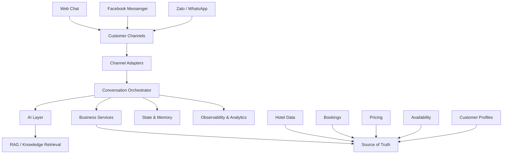
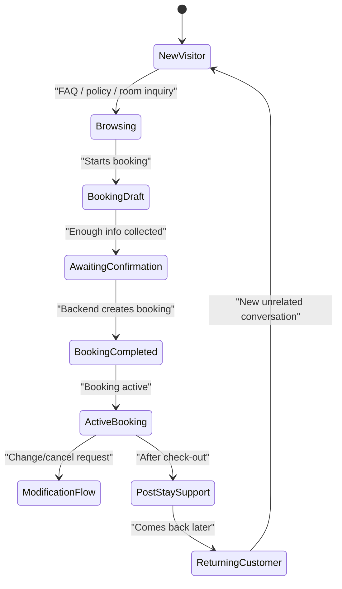

# Hotel Chatbot Production Blueprint

## Mục tiêu

Tài liệu này mô tả blueprint cho một hệ thống hotel chatbot AI đủ tốt để triển khai thực tế cho:

- khách sạn
- nhà nghỉ
- homestay
- boutique hotel
- resort nhỏ và vừa

Mục tiêu không chỉ là "chat được", mà là:

- hỗ trợ khách đúng ngữ cảnh
- bám dữ liệu thật
- an toàn nghiệp vụ
- dễ vận hành
- kiểm soát được chi phí AI
- scale được nhiều khách sạn và nhiều kênh

## Nguyên tắc thiết kế

### 1. AI không phải source of truth

AI chỉ nên làm các việc:

- hiểu ý khách
- trích xuất thông tin
- diễn đạt tự nhiên
- hỏi tiếp thông tin còn thiếu
- tóm tắt hoặc hỗ trợ quyết định

AI không nên tự quyết định các phần nghiệp vụ sống còn như:

- còn phòng hay không
- giá cuối cùng là bao nhiêu
- booking có thành công chưa
- booking nào đang active
- khách có quyền đổi/hủy hay không

Nguồn thật phải đến từ hệ thống dữ liệu.

### 2. Tách rõ chat state và business state

Phải tách:

- context hội thoại
- trạng thái booking
- hồ sơ khách hàng

Nếu dồn tất cả vào một session chat thì rất dễ bug.

### 3. Channel adapter không được làm vỡ workflow lõi

Web, Messenger, Zalo hay WhatsApp chỉ nên là adapter:

- nhận message
- chuẩn hóa message
- đẩy vào conversation orchestration
- gửi reply ngược ra channel

Lõi nghiệp vụ không nên phụ thuộc một channel cụ thể.

### 4. Production-first

Thiết kế phải tính đến:

- duplicate webhook
- retry
- delayed events
- nhiều message liên tiếp
- user quay lại sau vài ngày
- nhiều khách sạn
- nhiều nhân viên support

## Năng lực cốt lõi mà chatbot production phải có

### 1. Pre-booking support

- chào hỏi
- hỏi thông tin khách sạn
- hỏi vị trí
- hỏi tiện ích
- hỏi chính sách
- hỏi giá
- hỏi phòng trống
- tư vấn loại phòng

### 2. Booking support

- thu thập ngày check-in/check-out
- số khách
- loại phòng
- tên và số điện thoại
- promo code
- xác nhận lại thông tin
- tạo booking thật

### 3. Post-booking support

- xác nhận booking đã tạo
- nhắc lại mã booking
- tra booking gần nhất
- đổi thông tin booking
- hủy booking
- hỏi giờ check-in/check-out
- hỏi đường đi/liên hệ

### 4. In-stay support

- giờ ăn sáng
- hồ bơi/gym
- late check-out
- gọi lễ tân
- hỗ trợ dịch vụ cơ bản

### 5. Human handoff

- khiếu nại
- case không chắc chắn
- yêu cầu đặc biệt
- đoàn đông người
- invoice/VAT
- escalation cho người thật

## Kiến trúc tổng thể

## Lớp hệ thống

## 1. Channel Layer

### Vai trò

- nhận message từ từng kênh
- chuẩn hóa event về một format chung
- xử lý retry/deduplicate/debounce theo đặc thù channel
- gửi reply lại đúng kênh

### Yêu cầu

- channel-agnostic ở tầng trên
- map `channel + page/account + sender` thành conversation identity
- log raw event khi cần audit

### Ví dụ

- Web chat: session cookie hoặc client session id
- Messenger: `pageId + senderId`
- Zalo: OA id + user id

## 2. Conversation Orchestration Layer

Đây là trái tim của chatbot.

### Vai trò

- lấy normalized message từ channel
- debounce / merge nếu cần
- kiểm tra low-value messages
- quản lý session ngắn hạn
- load active booking context
- gọi AI đúng lúc
- route sang business service phù hợp
- quyết định lúc nào handoff

### Đây là nơi nên xử lý

- `ok`, `dạ`, `cảm ơn`
- greeting
- duplicate message
- message quá ngắn
- user quay lại sau vài ngày
- user đang có booking active

## 3. AI Layer

### Thành phần

- intent analysis
- entity extraction
- answer generation
- summarization
- fallback reasoning

### Model strategy

- model chat chính: tiết kiệm nhưng đủ tốt cho tiếng Việt
- model embeddings: nhỏ và rẻ
- không dùng model lớn cho mọi request

### Nguyên tắc

- AI phải dựa trên context chuẩn
- AI không tự bịa trạng thái booking
- AI không được tự tuyên bố booking thành công nếu backend chưa tạo booking thật

## 4. Knowledge / RAG Layer

### Nên dùng cho

- FAQ
- policy
- amenities
- room descriptions
- promotions
- location / nearby places

### Không nên dùng làm nguồn thật cho

- availability
- booking status
- pricing cuối cùng
- inventory theo ngày

### Nguyên tắc

- tri thức mô tả qua RAG
- dữ liệu giao dịch qua source of truth

## 5. Business Services Layer

### Các service tối thiểu nên có

- availability service
- pricing service
- booking service
- promotion service
- customer profile service
- booking lookup service
- cancellation / modification service

### Vai trò

- xử lý logic nghiệp vụ chuẩn
- validate đầu vào
- chống duplicate giao dịch
- trả dữ liệu chuẩn cho AI diễn đạt

## 6. Source of Truth Layer

### Giai đoạn đầu

Có thể dùng:

- Google Sheets

### Giai đoạn production ổn hơn

Nên tiến tới:

- database cho booking và customer
- hoặc tích hợp PMS / channel manager

### Nguyên tắc

Phải có nơi lưu được:

- booking thật
- availability thật
- pricing rule
- customer profile
- audit logs

## 7. State & Memory Layer

Đây là phần rất quan trọng để chatbot thực sự "thông minh".

## Ba tầng memory nên có

### A. Short-term Session

Mục đích:

- giữ ngữ cảnh hội thoại gần

Chứa:

- các message gần nhất
- intent hiện tại
- draft đang thu thập

Expire:

- ngắn, ví dụ 30 phút

### B. Active Booking Context

Mục đích:

- biết user đang có booking nào cần hỗ trợ

Chứa:

- booking id active
- check-in/check-out
- hotel id
- contact info liên quan

Expire:

- theo `check_out_date + grace period`

Ví dụ:

- khách đang chuẩn bị check-in
- đang lưu trú
- mới check-out 1-3 ngày

### C. Customer Memory

Mục đích:

- nhớ khách là ai qua thời gian dài

Chứa:

- customer profile
- booking history
- booking gần nhất
- optional summary của các lần trao đổi trước

Không nhất thiết:

- feed full raw history vào AI mỗi lần

## State machine nghiệp vụ đề xuất

## Data model tối thiểu nên có

### 1. CustomerProfile

Các field gợi ý:

- `CustomerId`
- `FullName`
- `PrimaryPhone`
- `Email`
- `PreferredLanguage`
- `ChannelIdentities`
- `LastBookingId`
- `LastInteractionAt`

### 2. ChannelIdentity

- `ChannelType`
- `ChannelAccountId`
- `ExternalUserId`
- `CustomerId`

Ví dụ:

- Messenger: `pageId`, `senderId`

### 3. ConversationSession

- `SessionId`
- `ChannelType`
- `ChannelConversationId`
- `HotelId`
- `CustomerId`
- `CurrentIntent`
- `ShortTermMessages`
- `CreatedAt`
- `LastActivityAt`
- `ExpiresAt`

### 4. ActiveBookingContext

- `ContextId`
- `CustomerId`
- `HotelId`
- `BookingId`
- `CheckInDate`
- `CheckOutDate`
- `Status`
- `ExpiresAt`

### 5. Booking

- `BookingId`
- `HotelId`
- `CustomerId`
- `GuestName`
- `GuestPhone`
- `RoomId`
- `CheckInDate`
- `CheckOutDate`
- `Status`
- `SourceChannel`
- `CreatedAt`

### 6. MessageLog

- `MessageLogId`
- `ChannelType`
- `ChannelConversationId`
- `Direction`
- `RawText`
- `NormalizedText`
- `Timestamp`
- `SessionId`
- `CustomerId`
- `HotelId`

### 7. AiUsageLog

- model
- operation
- prompt tokens
- completion tokens
- total tokens
- estimated cost
- hotel id
- session id

## Luồng xử lý chuẩn khi có message mới

### 1. Nhận message

- channel adapter nhận webhook/message
- xác định đây có phải text hợp lệ không
- dedupe
- debounce nếu cần

### 2. Resolve identity

- map channel user sang customer
- nếu chưa có thì tạo customer provisional

### 3. Load state liên quan

- short-term session
- active booking context
- customer memory cơ bản

### 4. Pre-routing

Kiểm tra:

- greeting
- thanks
- acknowledgement
- low-value message
- duplicate / retry
- handoff cases

### 5. Business-aware orchestration

Nếu là transactional request:

- tra data thật trước

Nếu là knowledge request:

- dùng RAG + hotel context

### 6. Gọi AI khi cần

AI chỉ nhận:

- short prompt
- context liên quan
- business facts đã chuẩn hóa

### 7. Persist state

- lưu message log
- cập nhật session
- cập nhật active booking context nếu cần
- cập nhật usage log

## Use case hậu-booking

Đây là nhóm rất quan trọng trong thực tế.

### Các intent nên có

- `booking_acknowledgement`
- `booking_lookup`
- `booking_modification`
- `booking_cancellation`
- `pre_arrival_support`
- `in_stay_support`

### Rule quan trọng

Sau khi booking thành công:

- không được để message kiểu `cảm ơn`, `ok`, `dạ` kích hoạt lại booking creation
- booking completed phải đóng booking draft cũ
- session vẫn có thể hỗ trợ booking đó, nhưng qua active booking context

## Use case user quay lại sau vài ngày

### Cách đúng

Không nên:

- lấy toàn bộ raw history rồi feed vào AI

Nên:

1. tra customer identity
2. tra active booking context nếu còn
3. tra booking gần nhất nếu không còn active
4. tạo session chat mới nếu context cũ hết hiệu lực
5. chỉ đưa summary liên quan vào AI

## Low-value messages

Nhóm này phải có rule-based path.

Ví dụ:

- `ok`
- `dạ`
- `vâng`
- `cảm ơn`
- `hello`
- `?`

### Cách xử lý

- không cần full AI flow cho mọi message
- có thể trả lời template hoặc lightweight path
- không thay đổi booking state trừ khi message có tín hiệu rõ ràng

## Temporal understanding

Chatbot ngành khách sạn phải xử lý tốt tiếng Việt đời thường.

### Các pattern cần hỗ trợ

- `mai`
- `mốt`
- `ngày kia`
- `thứ 7 tuần tới`
- `cuối tuần này`
- `ngày 13 tháng sau`
- `2 đêm từ thứ 7 tuần tới`
- `5/4`
- `5 tháng 4`

### Khuyến nghị

- parser deterministic cho ngày tháng quan trọng
- AI chỉ hỗ trợ các phần mơ hồ, không là nơi duy nhất quyết định ngày đặt phòng

## Multi-tenant / multi-hotel

Nếu làm SaaS thật, đây là bắt buộc.

### Phải tách được

- hotel data
- booking data
- knowledge base
- channel mapping
- usage tracking

### Mapping quan trọng

- `pageId -> hotelId`
- `hotelId -> sheet/database/source config`

## Human handoff

Bot production phải biết lúc nào dừng.

### Những case nên handoff

- khách nổi nóng
- case không chắc
- đổi booking phức tạp
- nhiều phòng / đoàn
- invoice/VAT
- phàn nàn dịch vụ

### Hệ thống nên có

- reason code cho handoff
- log escalation
- UI hoặc queue cho nhân viên tiếp nhận

## Observability và vận hành

### Bắt buộc nên có

- message logs
- AI usage logs
- booking success/failure logs
- duplicate event logs
- debounce logs
- error monitoring

### Dashboard nên có

- số message theo ngày
- số booking theo ngày
- conversion booking
- cost AI theo hotel
- top intents
- top failed flows

## Cost optimization strategy

### Nguyên tắc

- rule-based cho low-value messages
- debounce message liên tiếp
- RAG cho tri thức mô tả
- structured logic cho transactional truth
- model nhỏ cho phần lớn request

### Những gì không nên làm

- feed toàn bộ hotel context vào mọi request
- feed full conversation history cũ vào mọi request
- dùng model lớn cho mọi tin nhắn

## Roadmap triển khai

## Phase 1: MVP có thể bán

- Web chat
- Messenger
- FAQ/policy/room inquiry
- booking cơ bản
- usage tracking
- anti-duplicate cơ bản

## Phase 2: Release-ready

- active booking context
- hậu-booking flow
- cheap-path cho low-value messages
- customer identity mapping
- pageId -> hotelId mapping
- stronger idempotency

## Phase 3: Production-grade

- customer profile dài hạn
- booking lookup/modification/cancellation tốt hơn
- human handoff
- analytics dashboard
- multi-hotel operations

## Phase 4: Advanced

- đa kênh đầy đủ
- attachment/image understanding
- richer RAG
- personalization
- CRM / PMS integrations

## Checklist đánh giá production readiness

### Chat quality

- bot có hiểu tiếng Việt đời thường không
- bot có chịu được tin nhắn ngắn và nhiều tin liên tiếp không
- bot có không tự bịa booking status không

### Booking safety

- có chống duplicate booking không
- có clear state sau booking không
- có source of truth rõ cho availability và booking không

### Customer continuity

- user quay lại sau vài ngày bot có hiểu không
- có active booking context không
- có customer memory không

### Channel safety

- có dedupe webhook không
- có debounce không
- có echo ignore không
- có xử lý retry không

### Operations

- có usage tracking không
- có logs đủ để debug không
- có đo cost theo hotel không
- có theo dõi booking funnel không

## Kết luận

Một hotel chatbot AI production-ready không chỉ là một prompt tốt hay một model tốt.

Nó là sự kết hợp của:

- AI layer đủ mạnh
- business logic đủ chặt
- state management đúng
- source of truth rõ ràng
- channel adapters ổn định
- observability đầy đủ

Nếu làm đúng, chatbot sẽ:

- nói tự nhiên
- trả lời đúng
- đặt phòng an toàn
- hỗ trợ khách xuyên suốt hành trình
- kiểm soát cost tốt
- scale được cho nhiều khách sạn thực tế
